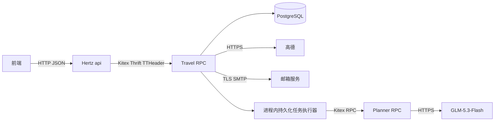

# 后端架构与运行说明

## 调用链

只运行三个应用进程；`admin` 是将已验证邮箱账号提升为管理员的一次性工具，`devdb` 是本地数据库工具。数据库连接仅在 travel/admin 建立。每个进程的 API 凭据由环境注入。

## 模型输出如何成为可保存行程

1. Travel 验证会话、请求参数及幂等键，保存 queued 任务，HTTP 返回 202。
2. 执行器用 `FOR UPDATE SKIP LOCKED` 原子领取，生成 attempt_id，提交数据库事务。
3. 从高德搜索景点及博物馆，筛选城市、类别、唯一编号，叠加管理员资料，最多 50 个候选。
4. Planner 经一次 GLM HTTP 调用生成严格 JSON。模型只能返回活动建议；费用、路线、角色和数据库版本不由模型写入。
5. Travel 校验日期、活动范围、时间、POI、停留/营业窗口和预算，再为相邻景点查询路线，检查连续空档能否容纳路线耗时加 5 分钟缓冲。
6. 可修复的模型/业务问题合并为一次反馈调用，最多两次模型请求。网络故障不自动重新生成。
7. 成功时一个 PostgreSQL 事务保存行程、版本、活动、路线与任务成功状态；过程中没有数据库事务跨越外部 HTTP 请求。

模型提示词与调用元数据可追溯。当前 v6 将轻松/均衡/紧凑节奏分别建议为每日 1～2/2～3/3～4 个景点，这些是软目标；硬上限仍为 5。缺少路线时建议保留宽裕的连续交通空档，获得真实路线后以实查耗时加 5 分钟校验。修复上下文保留活动、费用和路段耗时，去除重复地点快照及折线，减少无关输入。

## 任务状态与恢复

`queued → running → succeeded / failed / conflicted / interrupted`。状态查询返回真实阶段，不返回虚构进度百分比。单用户最多一个活动 AI 任务和一个活动手动编辑任务；8 路同时提交同一幂等键会返回同一 job。

默认两名执行协程，排队最多 5 分钟，执行最多 300 秒，租约 30 秒、每 10 秒续租。保存用 `clock_timestamp()` 检查当前租约及绝对执行期限，避免事务开始时的固定时间掩盖锁等待后的过期。扫描器将过期任务转为终态；显式重试创建新 job，不复活旧执行。

服务器退出会取消任务 context，停止领取并等待执行器退出。进程异常退出后，租约过期由重启后的扫描器收敛。模型可能已经执行但客户端超时，因此不声称供应商侧 exactly-once。

## 修改与版本

`expected_version` 是必须的乐观锁。较旧的异步结果不得覆盖较新的编辑。手动编辑也走任务执行器，执行路线与规则校验，不调用模型。

局部修改传入 scope 与自然语言要求，editable_item_ids 必须存在且完整位于日期时段内，不得与锁定集合相交。Travel 保留其余活动的原始快照与费用。替换活动使用新的后端编号；边界交通费用按未修改的外侧活动锚点比较，不能利用新编号绕过保护。需要改变边界费用或扩大编辑范围时返回 SCOPE_CONFLICT。

## 数据和身份

数据库表：users、sessions、places、planning_jobs、trips、trip_versions、trip_items、trip_routes，以及 auth_challenges、auth_rate_limits、schema_migrations。邮箱认证迁移为 users 增加邮箱、规范化邮箱键、验证时间和邮箱唯一索引；使用版本记录跳过已应用的 DDL，不删除原账号或业务数据。

会话令牌采用随机高熵值，数据库只存 SHA-256 摘要，8 小时过期、退出立即撤销。密码使用 bcrypt，输入严格要求 8–72 UTF-8 字节，不截断。Travel 每次请求重新校验当前用户、邮箱验证状态和角色；注册只能创建普通用户，管理员不自动拥有其他用户的私人行程访问权。

新注册先发 6 位邮箱验证码，再提交 email/password/code/challenge_id；成功仅返回 User，之后邮箱密码登录取得会话。用户响应保留 username 展示字段并追加 email/email_verified。规范化只去首尾空白、转小写域名，保留 ASCII 本地部分的大小写、点号和别名。未绑定邮箱的旧账号通过 LegacyLogin 登录；迁移期间仅能查询自己、注销和完成绑定，所有其他受保护业务均返回 EMAIL_VERIFICATION_REQUIRED。绑定保留 ID、密码、角色、会话和行程，已绑定账号不能用旧用户名登录或再次换绑。admin 只接受 ADMIN_EMAIL 提升已验证账号，不创建未验证的特权账号。

数据库不保存验证码原文，只存入绑定 challenge ID、邮箱、用途和用户 ID 的 HMAC。默认有效 600 秒、同邮箱重发间隔 60 秒、单 challenge 错码最多 5 次。发码分为事务预留 sending、事务外发送 SMTP、记录 ready/failed 三步；新码只有成功发送后才可验证并替代旧码，失败保留原先仍有效的码，迟到的旧发送结果不能覆盖较新的 challenge。发信不重试；超时后邮件可能已经到达，该次验证码仍可能无法使用。

注册/绑定锁定邮箱和 challenge，校验所属用户、用途、有效期和 HMAC，将创建/绑定与验证码消费放在一个事务中。错码计数独立提交，重放和超过次数的 challenge 均拒绝。已注册邮箱仍走相同发邮件流程，发码结果不随账号存在性改变；有效证明提交重复邮箱时消费证明并返回 EMAIL_ALREADY_REGISTERED，不改已有密码。登录错误统一为 INVALID_CREDENTIALS，并对找不到账号的路径执行 dummy bcrypt；数据库故障独立报告。

认证限流存入 PostgreSQL，跨实例按邮箱/账号、IP、全局共同生效。默认发码每小时 5/100/500、验证每小时 30/300/3000、登录每 15 分钟 10/100/1000；被限流的请求不增加计数，准入后密码/验证码错误仍计数。返回 AUTH_RATE_LIMITED 时正文 retry_after 与 Retry-After 头提供等待秒数。配置范围见 README。网关从 TCP 对端取 IP，不信任 X-Forwarded-For 等转发头；代理后的 IP 额度按代理连接地址聚合，目前没有可信代理配置入口。

SMTP 使用从连接开始建立的 TLS，验证证书，QQ 默认端口 465，不支持 587/STARTTLS。AUTH_CODE_HMAC_KEY 必须为 32–512 字节，同一数据库的所有实例与重启保持一致。公开 API 不返回验证码或 SMTP 授权码，会话令牌仅在登录响应提供；这些值均不写入应用日志，所有认证和当前用户接口响应禁止缓存。

历史版本不可变；外部景点资料更新不追溯修改历史。列表返回摘要，详情接口返回完整版本。费用全用整数分，按计费单位乘人数，未知项与已知小计分别统计。

## 超时和隔离

- 普通 HTTP/RPC：5 秒 / 3 秒；景点查询：8 秒 / 7 秒，地图 HTTP 5 秒。
- 邮箱发码：HTTP 15 秒 / RPC 14 秒 / SMTP 最多 10 秒；SMTP 超时可配置 1–10 秒，发送结果回写另有最多 2 秒的独立上下文。
- Planner RPC：130 秒；GLM HTTP 120 秒；整个任务 300 秒。
- TTHeader 传递 deadline，RPC 服务启用 context 超时，数据库与外部 HTTP 均使用 context。
- 地图全局初值 2 请求/秒；取消的等待不消耗未来时隙。每任务地图调用最多 64 次，不对全部候选进行两两算路。
- 公交明确无方案时，可额外查询一次步行；仅接受不超过 1500 米且不超过 1500 秒的实查路线，保持实际 mode/provider/queried_at/fee 并提示。两次查询都计入 64 次预算，缓存和基线复用也保留该提示；其他错误不会触发回退。
- 关闭应用级 RPC 重试与备用请求；模型不可用不会阻断已有行程查询或手动编辑。
- 数据库不可用返回 503，超时返回 504；不会把依赖故障误报为登录失效。

## 验证边界

本机 Go 与 PostgreSQL、Kitex/Hertz 真进程验证详见 verification.md。Dockerfile/Compose 提供可复现部署配置；是否已在当前环境构建运行以验证记录为准。前端页面与远端部署不属于本次交付。
