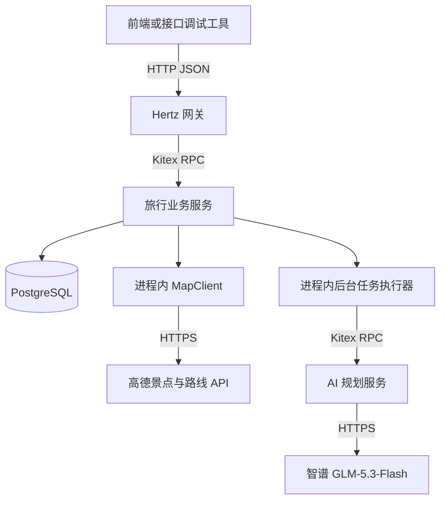
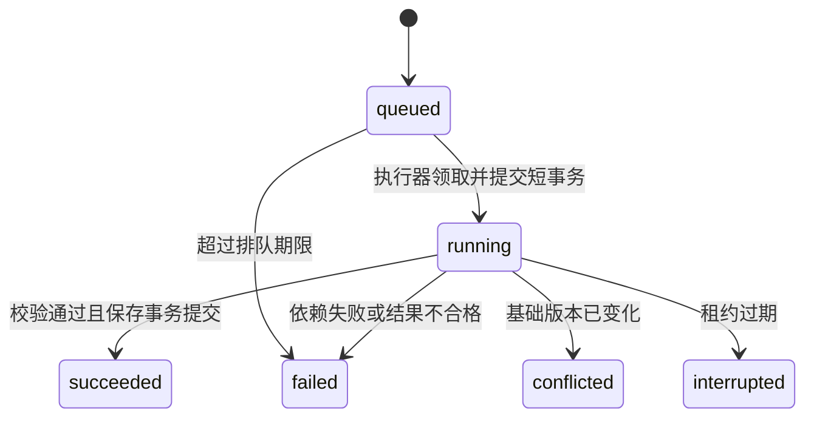

# AI 旅行行程规划师：后端设计与实现约定

日期：2026-09-07\
状态：用户已确认核心产品选择，并明确要求完成后端开发和前端接入文档。按照本文技术默认值进入实施；验证完成情况单独记录，不把设计视为测试结果。

本文保留设计过程。前端字段以 `docs/openapi.yaml`、`docs/frontend-integration.md` 为准，实际验证以 `docs/verification.md` 为准。实现中的具体约定如下：

- 公共类型由 `internal/domain/types.go` 维护，工具生成同构 Thrift 模型，再由 Kitex 生成 RPC 桩。下文概念结构名不等于 HTTP 字段名。
- 任务响应使用 `data.id` 和 `status_url`；手动编辑省略后端拥有的费用、地点快照和路线。
- 候选按“风景名胜＋博物馆”两次有界查询检索；偏好传给模型，室内修改优先检索博物馆。按 POI ID 去重，暂不保证识别景区与内部景点的层级重复。
- 地图限速初值固定为每秒 2 次、每任务最多 64 次；路线留白固定增加 300 秒。当前无全局调用量仪表盘或跨任务路线缓存。
- 实测后的策略调整：transit 为公交优先，仅明确 MAP_NO_ROUTE 时可尝试真实步行，须不超过 1500 米且不超过 1500 秒，返回实际方式及提示；鉴权、额度、网络故障不回退。下文早期严格方式设想由此约定替代。
- 7 天模型调用实测触发原 60 秒超时，因此最终初值调整为模型 HTTP 120 秒、Planner RPC 130 秒、任务执行 300 秒。仍最多两次模型调用，租约和续租不变；下文保留的早期数值不是最终配置。
- 失效模型文本供修复时截取最多 4096 字节；有效响应内容上限 256 KiB。不是所有原始输出都会落库。
- 每天保留一项未知首尾/餐饮/住宿接驳费用，防止预算被错误标记完整。

## 1. 已确认的目标与决策

- 本次交付仅为后端开发及供前端使用的文档，按课程 95 分档提供所需后端能力。前端页面、小组分工及答辩材料不在本次开发范围。
- 三个应用进程：Hertz HTTP 网关、Kitex 旅行业务 RPC、Kitex AI 规划 RPC。数据库是额外基础设施。
- 模型使用用户指定的 GLM-5.3-Flash，接入智谱开放平台的对话补全 API。
- 首版接入高德 Web 服务 API，查询真实景点和交通路线。用户提供的 Key 类型为 Web 服务；凭据值不写入本文。
- 首版只支持单城市旅行，不做跨城市串联；此范围已由用户确认。
- 首版交互采用“表单创建＋自然语言局部修改”：填写城市、日期、人数、预算和兴趣生成完整行程；选中日期或时段后提出修改要求，重排、校验路线并保存新版本。此交互方式已由用户确认。
- 预算口径已确认：包含景点门票、餐饮、住宿和市内交通，不包含出发地往返目的地的大交通；支持人均或全团预算，后台统一计算全团金额。价格注明来源和估算属性，缺失项标记待确认，不按零元计算。
- 特色能力是“基于资料和约束生成行程、局部重规划、规则校验与版本保存”。验收关注真实的输入到保存结果的流程。
- 用户已授权后端实现；不再以小组人数、排期为开发前置条件。未经用户明确要求不提交或推送代码，不删除已有文件。

## 2. 首版范围建议

首版单目的地城市的范围已确认，不支持跨城市串联。其余范围建议为中国大陆城市、1 至 7 天、1 至 8 人、人民币预算和中文交互。城市和景点通过高德查询，管理员补充游玩时长、标签、费用依据等资料。杭州可作为首个验收城市，其他城市走同一流程；候选不足或城市无法解析时返回明确原因，不声称全部城市已经验证。

预算口径已由用户确认：输入包含金额与口径（人均或全团），后端统一换算为全团金额，金额单位为整数“分”。费用覆盖景点门票、餐饮、住宿和市内交通，排除出发地往返大交通；创建接口和后续前端均明确这一口径。价格注明来源和估算属性，不能表示已锁定报价；缺失价格显示待确认，不按零元计算。

首版功能：注册登录与退出、普通用户和管理员权限、景点查询与资料维护、地图路线查询及交通时间校验、行程生成、手动修改、指定范围的自然语言重规划、历史版本查询、预算统计、任务状态查询和失败后显式重试。

已确认的创建流程使用表单收集结构化旅行参数；自然语言局部修改同时提交用户选择的日期或时段和修改要求。具体修改范围校验遵循第 5.3 节，成功后保存新版本。

交通方式建议首版提供步行、公共交通两种偏好；公交结果可以包含接驳步行。地图结果记录查询时间，代表查询时的路线估计，不保证未来出发时的路况、班次和耗时。无法核实的营业时间、预约要求与价格分别标注待确认。天气、在线预订、多人协作和通用网页搜索不属于本版验收范围。

## 3. 进程、调用和数据边界

| 进程 | 对外契约 | 职责 | 数据权限 |
| --- | --- | --- | --- |
| api | HTTP /api/v1 | 参数转换、请求编号、RPC 调用、错误映射、响应组装 | 无数据库连接 |
| travel | TravelService | 用户、会话、权限、景点、地图适配、路线校验、行程、版本、预算、任务和保存 | 唯一业务数据库读写方；持有高德访问凭据 |
| planner | PlannerService | 构造提示词、调用模型、解析模型输出、返回候选结果与调用摘要 | 无业务数据库连接，仅持有模型访问凭据 |

travel 内部按 auth、catalog、mapclient、trip、planning、validation、repository 模块组织。后台执行器与 travel 同进程，但有独立并发限制、执行期限和生命周期管理。planner 不回调 travel，不直接连接高德；候选资料、行程快照与路线冲突通过请求传入，避免循环调用与跨服务数据库事务。MapClient 是 travel 内的适配层，不新增第四个 RPC 服务。

拟采用一个代码仓库和一个 Go module，三个启动入口。IDL 为接口契约源，生成代码与业务代码分开。内部通信建议 Thrift + TTHeader；通过 Kitex 生成的强类型客户端调用。对外 HTTP 契约单独记录为 OpenAPI。

## 4. 身份与权限

建议使用服务端会话：登录成功返回随机高熵 Bearer Token，数据库只保存 Token 的摘要、用户编号、有效期和撤销时间。会话建议 8 小时有效，退出立即撤销；密码使用专用密码哈希算法保存。

网关转发身份凭据，travel 在受保护的 RPC 方法中验证会话，并从数据库读取用户状态和角色。外部请求的 user_id、role、owner_id 不能决定访问权限。注册接口只能创建普通用户，管理员由受控的初始化流程创建。

普通用户只能访问自己的行程、版本与规划任务。管理员可维护景点；管理员身份不默认授予读取所有私人行程的权限。身份失效返回 401；非管理员调用景点写接口返回 403；查询不属于自己的私人资源返回 404。

RPC 端口只暴露给本机或容器内部网络。planner 额外验证 travel 的服务凭据，避免绕过业务配额直接调用模型。身份凭据、地图和模型密钥、完整请求正文不进入普通日志；高德密钥位于请求查询参数中，HTTP 日志、错误对象和 tracing 必须去掉 URL 查询参数。

## 5. HTTP 与 RPC 接口契约

### 5.1 面向前端的接口

| HTTP | TravelService RPC | 说明 |
| --- | --- | --- |
| POST /api/v1/auth/register | Register | 创建普通用户 |
| POST /api/v1/auth/login | Login | 建立会话 |
| POST /api/v1/auth/logout | Logout | 撤销当前会话 |
| GET /api/v1/me | GetCurrentUser | 查询当前用户 |
| GET /api/v1/places | SearchPlaces | 按城市和关键词查询高德候选，叠加本地标签与补充资料 |
| POST /api/v1/admin/places | CreatePlace | 按服务端核实的高德 POI 建立资料记录 |
| PATCH /api/v1/admin/places/{id} | UpdatePlace | 管理员补充资料或停用推荐，不覆盖供应商地点身份 |
| POST /api/v1/planning-jobs | CreatePlanningJob | 保存新行程生成任务，返回 202 |
| GET /api/v1/planning-jobs/{id} | GetPlanningJob | 查询本人的任务、阶段和结果引用 |
| POST /api/v1/planning-jobs/{id}/retries | RetryPlanningJob | 为失败或中断任务创建新的任务 |
| GET /api/v1/trips | ListTrips | 分页查询本人的行程 |
| GET /api/v1/trips/{id} | GetTrip | 查询当前版本 |
| PATCH /api/v1/trips/{id} | UpdateTrip | 携带 expected_version 和幂等键，创建手动修改任务，返回 202 |
| POST /api/v1/trips/{id}/replanning-jobs | CreateReplanningJob | 按版本和指定范围创建重规划任务 |
| GET /api/v1/trips/{id}/versions | ListTripVersions | 查询版本列表 |
| GET /api/v1/trips/{id}/versions/{version} | GetTripVersion | 查询不可变的历史版本 |
| GET /api/v1/trips/{id}/budget | GetBudgetSummary | 当前版本的每日、分类和全团费用统计 |

业务列表默认 20 条，上限 100；地图景点查询单页最多 25 条，以 has_more 表达后续页，不把本页返回数量当作总量。资源编号使用字符串格式；时间使用带时区的 RFC 3339，行程日期使用目的地本地日期。首版目的地时区为 Asia/Shanghai。

手动修改也走既有持久化任务执行器，kind=manual_edit，执行规则与路线校验后保存新版本，不调用模型。这样不会在普通 HTTP 请求中等待多段算路；结果保存前当前行程保持原版本。AI 生成、AI 重规划分别为 generate、replan。

创建任务必须携带 Idempotency-Key。响应包含 job_id、status、request_id 和状态查询地址；相同用户、操作与键、相同业务请求体返回同一任务，业务请求体不同返回 409。处理顺序是鉴权、已有幂等结果查询、活动任务配额检查、事务创建；并发创建以唯一约束兜底。重复查询已有任务不占用新配额。

错误响应统一包含 code、message、request_id、可选 field_errors。业务拒绝与框架传输异常分别处理：400 参数错误，401 未认证，403 无权限，404 不存在或不可见，409 版本或幂等冲突，422 约束无法满足，429 提交配额限制，503 依赖不可用，504 同步调用超时。异步任务的执行错误在任务结果中呈现；正常读取失败任务本身仍返回 HTTP 200。

### 5.2 PlannerService 契约

| 方法 | 输入 | 输出 |
| --- | --- | --- |
| GenerateItinerary | 任务及尝试编号、旅行约束、候选景点快照、费用规则、资料版本 | 候选行程或无法满足的原因、待确认项、模型调用摘要 |
| ReviseItinerary | 上述信息加基础版本快照、修改范围、锁定活动、用户修改要求 | 指定范围内的替换建议或无法满足的原因、调用摘要 |

公共结构：

- TripConstraints：city_id、start_date、end_date、party_size、budget_total_cents、interests、pace、transport_preference。
- PlaceSnapshot：place_id、provider、provider_poi_id、city_id、citycode、adcode、name、tags、coordinates、coordinate_system、duration_minutes、opening_windows、fee、各字段来源、fetched_at、资料版本。
- ActivityDraft：date、start_minute、end_minute、kind、place_id、推荐理由。景点活动必须引用候选编号；餐饮、休息和住宿区域建议不冒充具体已验证商户。
- RevisionScope：date、start_minute、end_minute、editable_item_ids、locked_item_ids。
- PlanningOutcome：outcome（candidate、invalid_output 或 unsatisfied）、结构化候选内容、issues、warnings、model_run。invalid_output 表示可反馈给模型修复的格式或字段问题。
- ModelRun：provider_request_id、returned_model、prompt_version、耗时、Token 统计（未提供时为空）、finish_reason。
- RouteLeg：前后活动编号、方式、起终点 POI 与坐标、distance_m、duration_s、费用及口径、provider、queried_at、出发时间参数（若支持并使用）、路线摘要、可选路径坐标。由 travel 生成，随行程查询返回，模型不能伪造。

两个规划方法均支持可选 RepairContext（previous_output、validation_issues），由 travel 在第二次调用时传入。每个 RPC 至多发起一次模型请求。无法解析的原始输出只作为内部 invalid_output 的有界字段返回，最多 256 KiB，不直接向前端或普通日志返回；超过上限直接报错。使用此字段构造修复请求时将它作为待校验数据，不能视为新的系统指令。

首次生成可以返回完整计划；局部重规划只返回指定范围的修改。travel 负责合并、分配资源编号和全量验证。模型不产生 owner_id、角色、数据库版本号或最终费用总计。

### 5.3 自然语言修改的边界

重规划请求同时携带结构化范围和自然语言要求。后续前端允许用户先选择“第二天下午”或具体活动，再输入偏好；纯自然语言中范围含糊时返回需要明确范围的字段提示。首版不让模型自行扩大授权修改范围。

editable_item_ids 必须属于基础版本且完整落在指定日期时段内；与 locked_item_ids 交集必须为空。替换活动也必须完整落在该范围内。不在可编辑集合内的原活动由后端原样保留，包括费用依据。锁定活动即使位于范围内也不能修改。修改后检查与范围外前后活动的衔接；无法满足时返回冲突原因，用户可以重新选择更大范围。

## 6. 数据模型与一致性

建议采用 PostgreSQL。数据库事务覆盖“版本写入、活动项和路线写入、当前版本更新、任务成功标记”；模型与地图请求都在事务外执行。

| 表 | 主要字段 | 约束和用途 |
| --- | --- | --- |
| users | id、username、password_hash、role、status、created_at | username 唯一；role 为 user/admin |
| sessions | id、user_id、token_hash、expires_at、revoked_at | token_hash 唯一；验证当前用户状态 |
| places | id、provider、provider_poi_id、city_id、城市/区县编码、名称、坐标及坐标系、资料补充、字段来源、fetched_at、资料版本、active | (provider, provider_poi_id) 唯一；不因同名合并；未知信息不伪装成已知 |
| trips | id、owner_id、title、current_version、created_at、updated_at | current_version 是当前已保存版本 |
| trip_versions | trip_id、version、constraints、summary、warnings、source_job_id、created_at | (trip_id, version) 唯一；source_job_id 非空时唯一；版本不可变 |
| trip_items | trip_id、version、item_id、日期、时段、活动类型、place_snapshot、cost_components、reason | 绑定版本；未变活动保持 item_id；修改生成新版本活动集合 |
| trip_routes | trip_id、version、from_item_id、to_item_id、mode、距离、耗时、费用、查询条件与时间、provider、路线摘要 | 绑定同一版本；路线依据与活动同步保存 |
| planning_jobs | id、owner_id、kind、trip_id、base_version、input_snapshot、资料快照、status、stage、attempt_id、worker_id、heartbeat_at、lease_expires_at、deadline_at、结果引用、错误、调用摘要、幂等键与请求摘要、parent_job_id | 状态持久化；幂等组合唯一；按状态和创建时间索引 |

trips、trip_versions、trip_items 和 trip_routes 通过同一事务产生一致结果。生成成功前没有正式 trip；失败任务仍可查询。景点被修改不会追溯改变历史行程，保存支撑用户行程所需的最小景点、路线和费用依据；缓存及供应商数据留存遵守对应服务规则，不建设全量 POI 镜像。

预算由 travel 根据费用项计算：金额为整数分，每项记录计费单位、数量和资料/估算来源。只对已知费用计算已知小计；有未知费用时标记预算不完整，不能把未知当作零并宣称总预算达标。每天和分类统计始终使用同一已保存版本。

所有行程修改携带 expected_version。写入时对 trips.current_version 做条件更新；失败则回滚并返回版本冲突。AI 重规划完成后也使用创建任务时的 base_version，不覆盖新编辑。

## 7. 持久化任务执行

stage 表示搜索景点、生成、查询路线、验证、修复、保存等业务阶段，不显示虚构百分比；manual_edit 跳过模型阶段。所有终态保持不可变；显式重试建立新 job_id，并通过 parent_job_id 关联原任务。conflicted 要求用户读取最新版本后重新提交修改请求。

领取任务使用短事务和行锁，提交后才进行网络调用。建议使用 FOR UPDATE SKIP LOCKED，使多个执行协程不会领取同一 queued 任务。任务启动时生成 attempt_id，并更新 worker_id、执行期限和租约。

初始配置建议：执行并发 2、每用户最多 1 个活动 AI 任务（generate/replan 合计）及 1 个活动 manual_edit 任务、排队上限 5 分钟、执行总期限 180 秒、租约 30 秒、每 10 秒续租。以上是项目初值，需依据真实调用测量调整。每用户活动任务限制在锁定该用户记录的事务中检查和插入，防止并发提交穿透。手动修改与 AI 可并行准备，但最终仍通过同一版本条件更新竞争，先保存者成功。

续租与结果保存均检查 job_id、attempt_id、running 状态及有效租约；续租失败必须取消本地执行。续租不延长绝对执行期限。扫描器将过期执行置为 interrupted，超期排队置为 failed，不自动再次发送模型请求。

最终保存事务锁定并复核任务，检查行程基础版本，写入全部新版本内容并标记 succeeded。旧执行器的迟到响应无法把 interrupted/failed 任务改回成功。发生版本冲突时不写任何行程活动，单独把任务置为 conflicted。

HTTP 提交请求只负责创建任务；后台任务使用进程生命周期派生的独立 context，并保留 request_id/job_id。退出时停止领取任务，等待已有任务至退出期限；中断状态通过租约恢复。查询和手动编辑不依赖 planner 可用。

## 8. 模型与地图接入

### 8.1 GLM 官方文档核对结果

官方对话补全文档给出 POST https://open.bigmodel.cn/api/paas/v4/chat/completions 和 Bearer 认证，支持 messages、非流式响应、json_object 输出格式、request_id 与 usage。reasoning_effort 说明明确提到 GLM-5.3-FLASH 支持 low/high/max，但页面 model 枚举未列出对应 Flash 标识。此处存在文档覆盖不一致，不能据此判断当前账号是否已经可调用。

模型按用户指定的 GLM-5.3-Flash 保留，拟用请求标识 glm-5.3-flash。接入第一步必须在这个官方端点进行最小调用，核对账号权限、实际接受的模型标识、返回模型、JSON 模式与完成状态；不能静默改成其他模型。2026-09-07 已在官方端点完成最小调用，实际返回 `glm-5.3-flash` 和有效 JSON；完整业务链路见验证记录。

### 8.2 模型调用策略

planner 内部封装 ModelClient，第一版实现智谱适配器。配置包含 BIGMODEL_MODEL、官方 API URL、BIGMODEL_API_KEY、调用超时和输出预算。密钥仅供 planner 运行环境使用，文档、示例配置、日志和提交材料只保留变量名。

初次参数拟用 stream=false、response_format.type=json_object、reasoning_effort=low、max_tokens=8192；不同时调节多种采样参数。单次 HTTP 调用上限 60 秒，输出长度和推理档位经短行程及 7 天行程实测后调整。JSON 格式支持不等于字段或业务约束正确，仍需本地严格解析和校验。

响应处理只读取最终 content 作为候选行程，并检查 HTTP 状态、错误对象、choices、finish_reason、JSON 结构和业务约束。截断、空内容、拒绝、不符合预期的工具调用均不能当作完整行程。内部推理内容不作为用户推荐理由或项目日志。

原始候选和校验错误可在当前任务内触发最多一次有界修复调用；修复仍使用同一模型、同一资料和原修改范围。travel 将明确的校验问题随第二次规划 RPC 传入，planner 负责构造修复提示。一次任务最多两次模型调用，包括首次和修复。超时、鉴权、额度或服务不可用直接结束任务，不启用网络层自动生成重试。这个调用次数上限仅针对应用发起次数，不承诺第三方恰好执行一次。

业务 job_id、应用调用 attempt 编号与供应商 request_id 分别记录。供应商 request_id 只用于关联，不视为提供了供应商侧幂等保证。输入和资料快照保存在用户私有业务数据中，日志仅记录必要摘要和技术统计。

### 8.3 高德适配与规划流程

MapClient 首版实现 SearchPOIs 和 PlanRoute，使用高德官方 HTTPS 服务。AMAP_API_KEY 只注入 travel 运行环境；普通业务 RPC 和前端响应不包含此值。

1. travel 解析目的地城市，按兴趣执行有界 POI 搜索，使用城市限制和类别过滤。根据供应商 POI 编号去重，排除停车场、同名酒店等不匹配类别，处理景区与内部景点的重复安排；行政区县编码不能直接当作城市编号。
2. 将筛选后的候选身份、坐标及补充资料传给 planner。费用、营业时间缺失时保留未知状态，不用模型臆测填充成已核实数据。
3. AI 给出活动顺序后，travel 只查询每天相邻的已定位活动之间的路线，不对所有候选执行两两算路。首版建议每天最多 5 个景点，最多 50 个候选；路线采用用户选择的步行或公共交通方式，不擅自换成另一种方式。
4. 校验路线耗时加可配置缓冲能否放入两活动间的连续空闲时间窗，不能占用其他已安排活动。公共交通结果中的接驳步行已包含在方案内，不能重复计时。交通费用由 travel 按计费口径汇总；未知不能算成零。
5. 格式与规则错误、路线时间冲突共享第 8.2 节的一次修复机会，不能各自再发起一轮模型修复。将冲突的活动编号、实际查询耗时和可用时间反馈给模型；合并修复后重新查询变化路段，包括修改范围的前后边界，再全量校验。
6. 仅在校验完成后保存行程与路线的同一版本；缺路线、算路失败或达到调用上限时明确失败，不将直线距离或模型猜测作为已验证的交通结果。待确认价格等信息以 warnings 呈现，成功不代表所有外部信息都已确认。

路线验证范围是行程内已定位节点之间的衔接。没有选定 POI 的餐饮、休息、住宿建议必须标注位置待定，不能声称相关支线路线已验证；其占用时间仍参与日程校验。未确认酒店、出发地点时，不宣称每天首尾接驳已验证。跨天路线与往返目的地的大交通不在首版范围内。

局部修改保留范围外活动和费用依据；必须重查的边界路线如果导致范围外时间或费用需要变化，则返回范围不足的冲突，不静默扩大编辑范围。未变化路段可沿用基础版本的路线依据并保留原查询时间，不能把旧数据标为本次实时查询。

地图单次请求建议上限 5 秒，统一并发和 QPS 限制按账号配额配置。每任务初始上限 64 次地图请求，其中 POI 搜索最多 8 次；生成与修复共享上限。所有请求受任务剩余期限约束，额度或时间不足时停止，不无限重试。对相同查询做任务内复用，缓存保留查询时间并设置有效期；应用全局统计 POI、路线调用量和限流错误，不把文档免费额度当作账号实际剩余额度。

### 8.4 高德独立接口验证记录

2026-09-07 使用用户提供的 Web 服务 Key，直接请求 restapi.amap.com，完成 2 次 POI 查询和 2 次路线查询；均返回 HTTP 200、status=1、infocode=10000。密钥未保存到工作区，记录只包含公开景点和返回摘要。

| 验证项 | 本次结果 |
| --- | --- |
| POI 搜索 /v5/place/text | 杭州市严格城市范围内查询到“杭州西湖风景名胜区-断桥残雪”和“雷峰塔景区”，返回 POI 编号与经纬度 |
| 步行 /v5/direction/walking | 上述两点之间返回 1 条方案；4,874 米、3,899 秒、10 个步骤，包含路径坐标 |
| 公交 /v5/direction/transit/integrated | 返回 5 条方案；首条 5,599 米、2,774 秒，包含步行 1,187 米，接口票价字段为 2 元，线路为西湖内环线 |

这证明本次 Key 能调用所测接口，不代表应用已接通、账号剩余额度已查明或未来出行耗时已经确认。路线测试请求包含 cost、polyline 扩展字段。后续应用、模型与持久化验证另见 `docs/verification.md`；此表仅记录当时的独立探测。

## 9. 行程校验与 95 分特色

travel 先获取并规范化所需资料和路线，再将候选与这些证据传给纯业务校验器；校验器自身不发起网络请求：

1. 字段、枚举、数值、日期和时段合法，天数与输入一致。
2. 景点编号来自传入资料，地点属于目标城市；日期时段与明确已知的营业窗口一致。
3. 同日活动不重叠，停留时间合理，餐饮、休息不挤占交通窗口；已定位相邻节点的地图路线耗时及缓冲能放入计划，未定位支线明确提示待确认。
4. 必须保留活动和修改范围外字段保持不变，包括活动标识、时间、地点和说明。
5. 费用由服务端计算，按预算口径汇总；超预算、资料不足或未知费用分别处理。
6. 保存时行程版本和任务租约仍有效。

硬约束违反时不得发布为成功行程；软偏好无法完全满足时返回原因，允许有效计划附带说明。低预算、候选不足与模型输出错误使用不同错误码，方便用户采取对应动作。

核心演示：使用真实地图候选生成一份 3 天行程，然后要求“第二天下午改为室内活动，其他时间不变”，展示景点依据、交通时间校验、局部差异、预算更新、版本记录与重新查询结果。移除 AI 将失去自然语言约束理解和局部重排能力；移除地图则失去真实地点与路线依据。推荐理由解释偏好匹配和安排依据，不展示模型内部推理过程。

## 10. RPC 治理与本地运行建议

普通 CRUD API/RPC 建议以 5 秒/3 秒为初始期限；同步景点查询与管理员 POI 核实单独配置为 HTTP 8 秒、RPC 7 秒、地图 HTTP 5 秒。后台规划 RPC 上限 70 秒，内部模型 HTTP 上限 60 秒，任务执行总期限 180 秒，包含搜索、生成、算路和最多一次修复。每步按剩余期限裁剪超时；这些上限不保证最坏情况下所有步骤都能完成，应通过实测调整。不同调用类型分别配置客户端，不能共享一个全局超时。

Thrift 非流式调用需要显式配置 TTHeader 元信息和服务端 context 超时传播。服务端数据库和模型客户端使用对应 context，不能仅让调用端超时而下游无限执行。详情以接入时锁定的 Kitex 版本文档和实际取消测试为准。

首版关闭应用级自动 RPC 重试和 Backup Request，任务创建用持久化幂等，模型失败由用户显式重试。启用请求编号、结构化日志、panic 恢复、超时分类和健康检查；模型不可用不阻塞历史查询和手动修改，地图不可用时历史查询仍正常，需要新路线的修改明确失败。

本地建议 Docker Compose 启动三个应用与 PostgreSQL，通过服务名和端口直连；不需要额外注册中心。数据库使用持久卷，正常停止不删除卷。验收包含空数据库初始化、重复初始化、重启后的数据可读和三进程调用链。依赖与代码生成工具在实施时锁定兼容版本。

## 11. 验收计划

| 层级 | 验收情形 | 预期结果 |
| --- | --- | --- |
| 鉴权 | 普通用户调用管理员接口、跨用户访问行程/版本/任务、会话退出后重用 | 按权限拒绝，数据不泄露 |
| 业务校验 | 无效地点、重叠时间、越界修改、锁定活动变化、超预算、未知费用 | 明确拒绝或标注，不能误报完整可行 |
| 幂等 | 相同请求重复与并发提交、同键不同请求 | 同一任务或 409；不额外生成 |
| 并发编辑 | AI 执行时手动修改任务先保存成功 | AI 任务 conflicted，保留用户新版本；反向顺序同样拒绝旧版本覆盖 |
| 持久化 | 任务与行程保存时失败、执行器重启、租约过期后迟到响应 | 无半个版本、无永久 running、无迟到覆盖 |
| 故障隔离 | planner 停止或模型超时 | 新规划明确失败，已有行程继续查询和编辑 |
| GLM 适配 | 模拟鉴权失败、限流、超时、空响应、截断和非法 JSON | 正确分类；不假装成功；不泄露凭据 |
| 地图适配 | HTTP 200 但业务错误、无路线、限流、同名错误类别、重复景点、坐标系不一致、费用缺失 | 按供应商业务状态判断成功，正确过滤及标注，不伪造路线 |
| 路线校验 | 交通时间放不进空档、局部修改影响前后衔接、边界费用变化、修复后再次冲突 | 最多一次模型修复；不挤占锁定活动或扩大范围；失败不发布新版本 |
| 真实地图 | 景点搜索、步行和公交、修改后重算、额度及超时控制 | 独立接口已实测；应用内调用和版本保存仍需验收 |
| 真实模型 | 官方端点、指定模型、短行程生成、7 天行程生成、局部重规划 | 实际调用成功且业务检查通过，记录实际耗时和 Token |
| 数据闭环 | 创建、生成、修改、预算统计、重启后查询 | API、数据库、预算和版本一致 |

模型单元测试采用本地受控响应；真实调用单独执行并标识，不把模拟通过记为模型接通。业务校验器、权限、幂等、版本冲突和任务状态机是主要自动测试对象。

## 12. 文档与实现分段

实现顺序建议：接口契约与三进程连通 → 用户/景点/行程持久化 → GLM 最小接入验证与高德适配 → 持久化生成任务及路线校验 → 局部重规划、手动修改和版本冲突 → 故障与权限验收 → 运行文档和答辩用接口演示。

需要产出的项目材料：README、OpenAPI、IDL 说明、数据库与调用时序说明、模型与地图接入及校验说明、验收记录、真实 Vibe Coding 日志。每条 Vibe 日志记录目标、实际提示词、AI 结果、实际问题、修改和组员理解；本设计不能冒充已发生的开发日志。

后续实现计划应围绕以上验收项分任务。完成后端只完成课程项目的一部分，后续前端需展示登录、创建/查询/修改、管理员差异和来自后端的动态预算。

## 13. 资料依据

- [Kitex 官方 README](https://github.com/cloudwego/kitex/blob/main/README_cn.md)：RPC 框架、IDL 和服务治理能力。
- [Kitex 进阶教程](https://www.cloudwego.io/zh/docs/kitex/getting-started/tutorial/)：Hertz HTTP 入口与 Kitex RPC 调用组合。
- [Kitex 协议说明](https://www.cloudwego.io/zh/docs/kitex/tutorials/basic-feature/protocol/)：Thrift 和 TTHeader 支持。
- [Kitex 超时控制](https://www.cloudwego.io/zh/docs/kitex/tutorials/service-governance/timeout/)：调用期限与服务端 context 配置。
- [Kitex 请求重试](https://www.cloudwego.io/zh/docs/kitex/tutorials/service-governance/retry/)：重试与幂等的关系。
- [智谱对话补全](https://docs.bigmodel.cn/api-reference/%E6%A8%A1%E5%9E%8B-api/%E5%AF%B9%E8%AF%9D%E8%A1%A5%E5%85%A8)：端点、认证、JSON 输出、推理参数和响应字段；核对日期 2026-09-07，模型枚举覆盖情况见第 8 节。
- [PostgreSQL SELECT](https://www.postgresql.org/docs/current/sql-select.html)：SKIP LOCKED 在队列消费者场景的用途。
- [高德 POI 搜索 2.0](https://lbs.amap.com/api/webservice/guide/api-advanced/newpoisearch)：城市限制、分页与 POI 返回字段。
- [高德路径规划 2.0](https://lbs.amap.com/api/webservice/guide/api/newroute)：步行和公共交通端点、输入及可选耗时/路径字段；独立实测见第 8.4 节。
- [高德创建项目与 Key](https://lbs.amap.com/api/webservice/create-project-and-key)：后端使用 Web 服务类型凭据。

课程要求来自用户提供的六张图片；项目范围、服务职责、数据库结构、任务状态和参数初值是本项目的设计建议。
